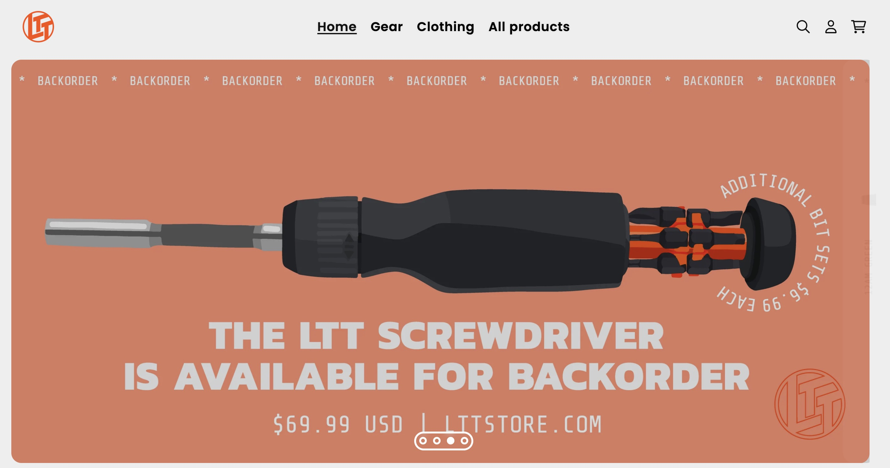
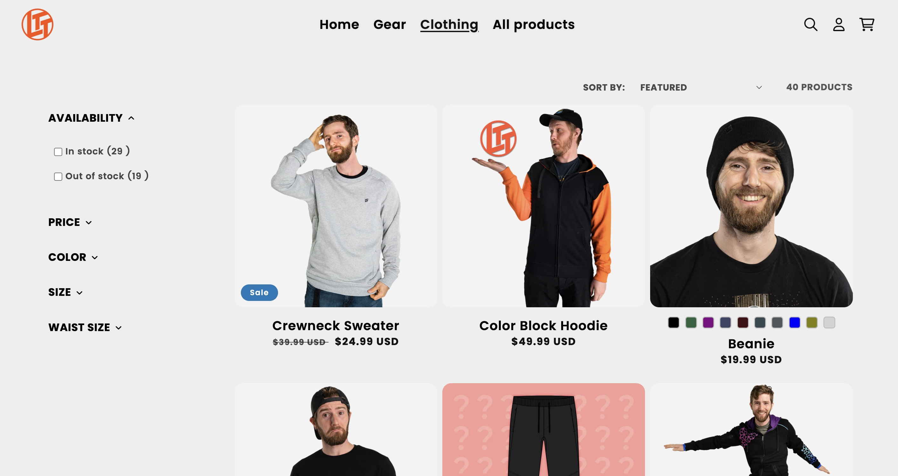
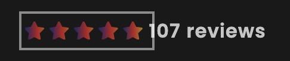
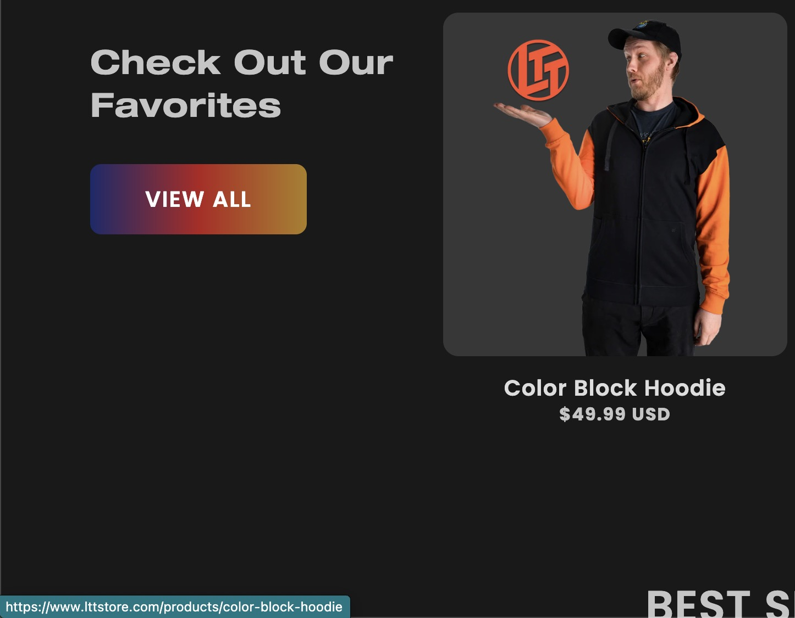

# Procesverslag
Markdown is een simpele manier om HTML te schrijven.  
Markdown cheat cheet: [Hulp bij het schrijven van Markdown](https://github.com/adam-p/markdown-here/wiki/Markdown-Cheatsheet).

Nb. De standaardstructuur en de spartaanse opmaak van de README.md zijn helemaal prima. Het gaat om de inhoud van je procesverslag. Besteedt de tijd voor pracht en praal aan je website.

Nb. Door *open* toe te voegen aan een *details* element kun je deze standaard open zetten. Fijn om dat steeds voor de relevante stuk(ken) te doen.

## Jij

  
uitwerken voor kick-off werkgroep

  ### Auteur:
  Youri Langenberg

  #### Je startniveau:
  Rood (met het soms proberen van zwart)

  #### Je focus:
  Responsive design
 

## Je website

  
uitwerken voor kick-off werkgroep

  ### Je opdracht:
  https://www.lttstore.com/

  #### Screenshot(s) van de eerste pagina (small screen): 
  Homepage 
   
  

  #### Screenshot(s) van de tweede pagina (small screen):
  Clothing
   
  
 

## Toegankelijkheidstest 1/2 (week 1)

  
uitwerken na test in 1e werkgroep

  ### Bevindingen
  Lijst met je bevindingen die in de test naar voren kwamen:

  #### Screenreader
  LTTStore is goed te gebruiken, alles is duidelijk geprogrammeerd zodat de 
  screenreader alles kan lezen en er snel door heen kan gaan. er is zelfs   
  een knop om het begin te skippen.

  #### Muis en Toetsenbord 
  
  Er zijn geen duidelijke highlights als je tab klikt op de homepagine, het mist bij plaatjes en knopjes. Als je een andere pagina bezoekt zoals Clothing of product dan zie je het wel duidelijk bij al het content.
  
  

  Hier een omschrijving van hoe het opgelost kan worden (met indien nodig afbeeldingen)
  Een duidelijke border toevoegen aan plaatjes en titels van producten.

  #### Motoriek (shocks, elastiekjes)
  Hier korte omschrijving (met indien nodig afbeeldingen)
  Het gebruiken van de shocker is voor mij helemaal niet te gebruiken. Daarmee zou ik geen computers mee kunnen bedienen.

  #### Visueel (brillen, contrast, kleurenblind, dark/light). 
  
  Visueel is de website nog goed te doen gezien dat de achtergrond wit of zwart is (gebasseerd op jouw instellingen). Zelfs de highlighted knoppen kunnen nog goed gezien worden.

  De website is goed te gebruiken met verschillende visuele beperkingen.

## Breakdownschets (week 1)

  
uitwerken na afloop 2e werkgroep

  ### de hele pagina: 
  
  
  

  ### dynamisch deel (bijv menu): 
  -
  

  ### wellicht nog een dynamisch deel (bijv filter): 
  -
  

## Voortgang 1 (week 2)

  
uitwerken voor 1e voortgang

  ### Stand van zaken
  hier dit ging goed & dit was lastig (neem ook screenshots op van delen van je website en code)
  Het werken met grids is wat lastiger dan Flexboxen maar ik vind het wel goed gaan. Het is zeker een uitdaging
  om een website zo goed mogelijk na te maken.
  

  ### Agenda voor meeting
  samen met je groepje opstellen:

  Youri Langenberg:
  Op dit moment wil ik weten hoe ik het beste de header kan positioneren zodat het onder de gradient staat

  Laura Wilting:
  Ik wil weten waar ik het beste mee kan beginnen in mijn CSS.
  
  Pepijn de Wolff:
  Ik wil weten of mn html semantisch genoeg is

  ### Verslag van meeting
  hier na afloop snel de uitkomsten van de meeting vastleggen
  We kunnen elkaar lastig op weg helpen via deze manier en willen daarom graag morgen in de les
  om hulp vragen aan de docent en/of de student assistenten.
  Niet schreeuwen (Uppercase)
  Taal naar engels zetten anders is het niet goed voor Google (SEO)
  3 style sheets
    - Algemeen (fonts, footer, header)
    - Homepage
    - Product page
  

## Voortgang 2 (week 3)

  
uitwerken voor 2e voortgang

  ### Stand van zaken
  hier dit ging goed & dit was lastig (neem ook screenshots op van delen van je website en code)
  Meerdere carrouserls maken en de hamburger nav menu waren beide erg lastige opdrachten om goed te krijgen op mijn website

  ### Agenda voor meeting
  samen met je groepje opstellen

  Laura Wilting:
  Ik snap mijn footer niet

  Youri Langenberg:
  Nog geen vragen

  Pepijn de Wolff
  Wat je extra kan toevoegen qua toegankelijkheid

  ### Verslag van meeting
  hier na afloop snel de uitkomsten van de meeting vastleggen
  - Maak breakdownschets

## Toegankelijkheidstest 2/2 (week 4)

  
uitwerken na test in 8e werkgroep

  ### Bevindingen
  Lijst met je bevindingen die in de test naar voren kwamen (geef ook aan wat er verbeterd is):

  #### Screenreader
  Hier korte omschrijving (met indien nodig afbeeldingen)

  Hier een omschrijving van hoe het opgelost kan worden (met indien nodig afbeeldingen)

  #### Muis en Toetsenbord 
  Hier korte omschrijving (met indien nodig afbeeldingen)

  Hier een omschrijving van hoe het opgelost kan worden (met indien nodig afbeeldingen)

  #### Motoriek (shocks, elastiekjes)
  Hier korte omschrijving (met indien nodig afbeeldingen)

  Hier een omschrijving van hoe het opgelost kan worden (met indien nodig afbeeldingen)

  #### Visueel (brillen, contrast, kleurenblind, dark/light). 
  Hier korte omschrijving (met indien nodig afbeeldingen)

  Hier een omschrijving van hoe het opgelost kan worden (met indien nodig afbeeldingen)

## Voortgang 3 (week 4)

  
uitwerken voor 3e voortgang

  ### Stand van zaken
  Homepage is klaar, met nog kleine veranderingen nodig hier en daar.
  Start met 2de pagina

  ### Agenda voor meeting
  samen met je groepje opstellen

Youri Langenberg:
Hoe kan ik de li echt in het midden krijgen
Hoe kan ik de animaties beter krijgen
is mijn breakdownschets goed

  ### Verslag van meeting
  hier na afloop snel de uitkomsten van de meeting vastleggen
  - Padding weggehaald
  - Scale
  - Ja
  - Visually hidden gebruiken voor screenreaders
  - skip to content <a :focus gebruiken>

## Eindgesprek (week 5)

  
uitwerken voor eindgesprek

  ### Je uitkomst - karakteristiek screenshots:
  

  ### Dit ging goed/Heb ik geleerd: 
  Korte omschrijving met plaatjes

  

  ### Dit was lastig/Is niet gelukt:
  Korte omschrijving met plaatjes

  

## Bronnenlijst

  
continu bijhouden terwijl je werkt

  Nb. Wees specifiek ('css-tricks' als bron is bijv. niet specifiek genoeg).

  1. bron 1
  2. bron 2
  3. ...

